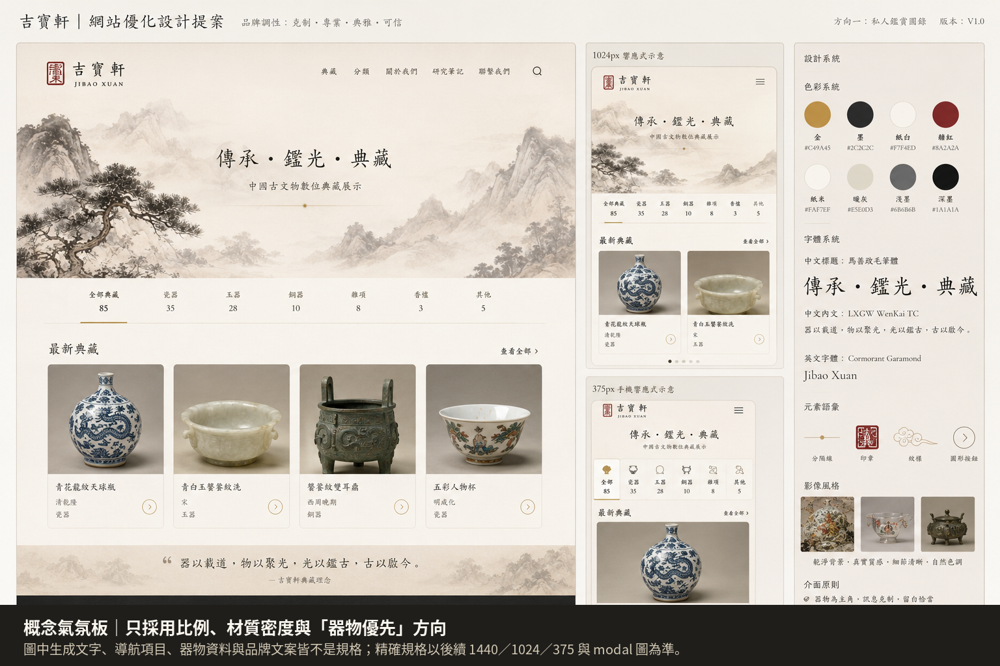
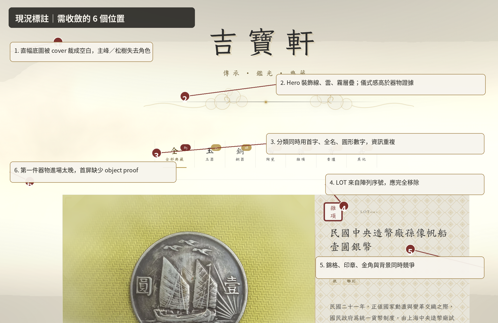
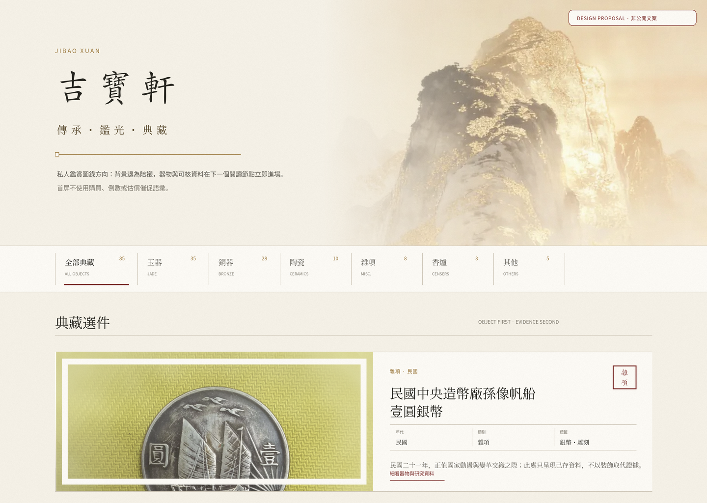
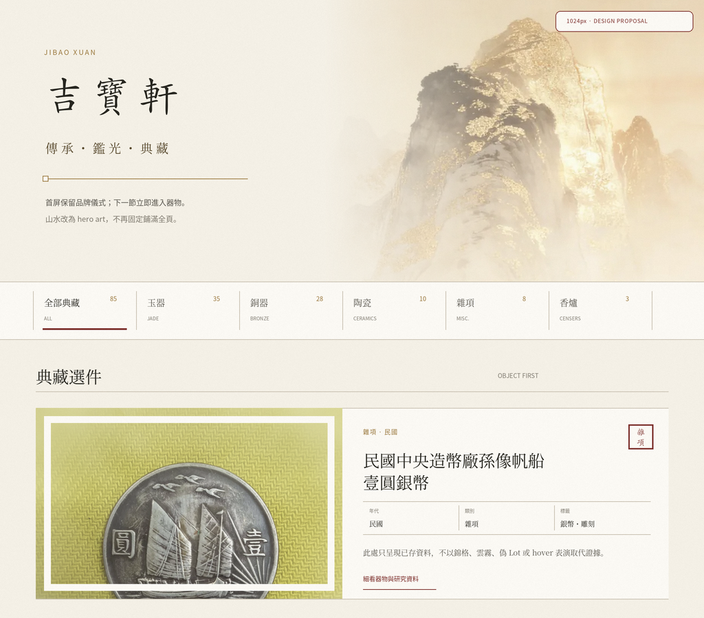
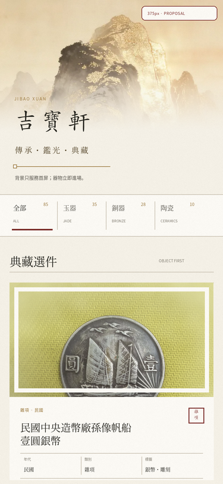
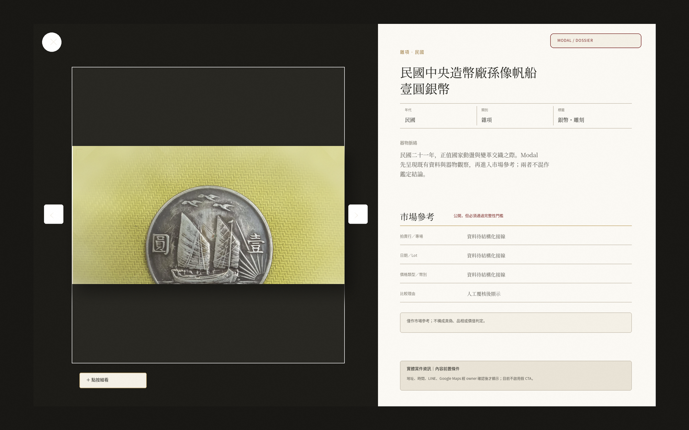

# 吉寶軒「私人鑑賞圖錄」UX／GUI 優化設計圖提案 v1

> **狀態：PROPOSAL ONLY｜可分批審核，不構成實作、部署或資料欄位變更授權**  
> 日期：2026-08-21  
> Review subject：本輪上傳的新版 `index.html`。GitHub Pages 尚未更新；正式實作前仍須與 `Publish/index.html` 做一次 deployed-subject diff。

---

## 0. Craig 本輪決策紀錄

| 決策項 | Craig 回覆 | 本提案採用方式 |
|---|---|---|
| 正式視覺基線 | 本輪上傳檔案應為較新版本，Git 尚未更新 | 本文件以本輪 `index.html` 與上傳截圖為設計 subject；部署前需重新映射 `Publish/index.html` 行號 |
| LINE／地址／開放時間／Google Maps | 未來與文物 owner 討論後補充 | 保留「實體賞件資訊」的版面策略，但公開頁現階段不顯示假資料、假按鈕或回覆時效 |
| 公開典藏編號 | 沒有 | 設計中完全移除 `LOT 001` 類型序號；不以 UUID 或排序索引替代 |
| 市場參考 | 需要公開，未來不需要再隱藏 | 採用結構化「市場參考」模組；只有資料完整且人工覆核時顯示，不展示裸價或無來源的參考 |
| 母方向 | 同意「私人鑑賞圖錄」 | 本輪所有精確 mockup 均以此方向展開 |

### 必要修正：市場參考不是「多一層一定不會比較差」

此決策可以成立，但必須加上 **完整性 hard gate**。缺少拍賣行、專場、日期、Lot、價格類型、幣別、來源頁或比較理由的「參考價格」，會比完全不顯示更傷害高端藏家的信任。

因此本提案的原則是：

> **市場參考公開；不完整市場參考不公開。**

---

## 1. 視覺設計圖索引

### 1.1 概念氣氛板

此圖只用來確認比例、器物優先、留白密度與色彩克制。圖中生成的文字、導航、器物資料與 IA 均不是規格。

### 1.2 現況問題標註

### 1.3 1440px 桌面提案

### 1.4 1024px 平板提案

### 1.5 375px 手機提案

### 1.6 Modal／市場參考提案

---

## 2. 設計總結

### 核心轉向

目前頁面主要用山水、WebGL 霧、如意雲、錦格、印章、四角金線、卡片雲霧、3D tilt 與 `LOT` 語彙營造中國性。提案改為：

1. **器物先於場景**：首屏保留品牌儀式，但第一個 viewport 已可看見分類與第一件器物。
2. **證據先於裝飾**：卡片先呈現品名、年代、類別、標籤與完整句摘要；細節、觀察與市場參考進入 modal。
3. **一頁只保留一個文化符號焦點**：Hero 使用山水；卡片只保留小型分類印記；正文不再重複山水、錦紋、祥雲與仿裱飾。
4. **市場參考與鑑定語意分離**：市場參考是可比案例，不是真偽、品相、來源或價值結論。
5. **實體賞件是內容前置條件**：LINE、地址、時間與地圖完整後才顯示導流模組。

---

## 3. 各介面位置的精確設計

## 3.1 Hero／首屏

### 現況問題

- 直幅背景被 `center center / cover` 當成固定全頁底圖，桌面只留下中段亮色區域。
- 山水、SVG 紙紋、暗角與 WebGL 霧同時存在。
- 品牌標題、標語、如意雲與 scroll invite 延遲依序入場，器物證據被推遲。
- 目前程式證據：`index.html` 約 L150–L196、L202–L426、L3312–L3509。

### 提案

- 背景圖改為 **Hero 專用 art panel**，不再固定鋪滿全頁。
- 1440／1024：山峰位於右側，左側保持可閱讀的素紙面；以漸層完成自然淡出，不再依賴霧遮。
- 375：使用背景原本的直幅優勢，山峰保留在上半部，品牌置於山景下方的素紙區。
- 如意雲鏈改為單一細線與一個方形節點；不再持續浮動。
- `WebGL fog`、固定 `ink-vignette` 與全頁 background image 退出此方向。
- 首屏品牌仍使用現有「吉寶軒／傳承・鑑光・典藏」；mockup 中的其他說明均為設計註記，不是公開文案。

### 目標幾何

| 斷點 | Hero 目標高度 | 首件器物露出要求 |
|---|---:|---|
| 1440 | 約 480–520px | 1024px 高 viewport 中至少露出卡片上方 240px |
| 1024 | 約 400–440px | 900px 高 viewport 中至少露出卡片上方 260px |
| 375 | 約 300–330px | 812px 高 viewport 中至少看見主圖與品名開頭 |

---

## 3.2 Category rail／分類與發現

### 現況問題

目前每個分類同時呈現：

- 首字大 glyph；
- 完整中文名；
- 圓形數量 badge；
- 垂直分隔；
- active 金色文字與底線。

這使分類列像裝飾吊牌，而不是圖錄目次。程式證據：`index.html` 約 L428–L520、L1751–L1895、L2754–L2825。

### 提案

- 改為「完整分類名＋小型件數＋極小英文索引」。
- 移除首字 glyph 與圓形 badge；件數不再做成彩色徽章。
- Active 狀態只使用一條朱紅底線；文字保持墨色。
- 1440／1024 採單行橫向目次；375 採水平滑動，不加入 hover-only 資訊。
- 保留現有鍵盤 tablist、roving tabindex、aria-selected 與 live-region 播報。

### 不新增功能

- 不加入年代、材質、價格或排序 filter。
- 不新增搜尋、收藏、會員或購物相關功能。
- 新篩選維度若未來需要，須另列 Tier 1。

---

## 3.3 Card／單件賞析卡

### 現況問題

同一張卡片目前同時使用：

- 錦格＋紙紋資訊底；
- 四角金線；
- 大型分類印章；
- `LOT 001`；
- vignette blur；
- moving cloud；
- focus border；
- 圖片 zoom；
- card lift 與 3D tilt。

程式證據：`index.html` 約 L549–L719、L747–L842、L3595–L3628、L3676–L3716。

### 提案

- 卡片改為 **器物圖版＋素色資料欄**。
- 只保留一枚小型分類印記，不同時使用錦格、金角、雲霧。
- 完全移除 `LOT`；目前沒有穩定公開編號，不顯示任何替代數字。
- 卡片公開資訊順序：
  1. 分類／年代；
  2. 品名；
  3. 年代、類別、既有標籤；
  4. 完整句摘要；
  5. 「細看器物與研究資料」。
- 市場參考不放卡片，避免價格主導第一層閱讀。
- 圖片只做輕微亮度校正；不加 sepia、仿古濾鏡或霧化。
- Hover 只允許 1–2px 位移或邊線加深；手機不依賴 hover。

### 圖片契約

現有來源照片的背景與構圖不一致，不能只靠 `object-fit: cover` 自動決定裁切。後續應增加「人工主圖／焦點裁切規則」，但這屬內容與資料流程提案，不在本輪直接實作。

---

## 3.4 Modal／單件細看

### 建議資訊順序

1. 大圖、zoom、pan、前後件導覽；
2. 品名、年代、類別、標籤；
3. 器物脈絡；
4. 經人工覆核的器物觀察；
5. 市場參考；
6. 實體賞件資訊。

現有 zoom、pan、focus trap、方向鍵導覽與 reduced-motion 基線可以保留。資料區不再統稱「鑑定參考」。

### 市場參考模組

公開模組名稱建議使用：

- **市場參考**
- 或 **可比拍品參考**

不建議使用：

- 鑑定參考；
- 估值；
- 鑑價；
- 真偽依據；
- 收藏價值。

### 顯示完整性門檻

| 欄位 | 顯示前要求 |
|---|---|
| 拍賣行 | 一手來源名稱已核對 |
| 專場 | 專場名稱已核對 |
| 日期 | 拍賣日期已核對 |
| Lot | 拍賣來源中的真實 Lot；不是吉寶軒卡片序號 |
| 價格類型 | 明確標示「成交價」或「估價」 |
| 幣別 | 必填，不自行換算 |
| 數值 | 原始來源值；不得由 AI 估價 |
| 來源頁 | 可追溯 URL 或館藏／拍賣記錄 locator |
| 比較理由 | 說明尺寸、材質、年代、形制或題材的可比點 |
| 人工覆核 | reviewer、reviewedAt、verified 狀態完整 |

### Fail-closed 規則

只要上述任一核心項缺失：

- 整個市場參考區隱藏；
- 不單獨顯示 `refPrice`；
- 不以 `displayRecommendation` 補位；
- 不顯示「資料待補」給一般訪客。

### 固定聲明

> 僅作市場參考；不構成真偽、品相或價值判定。

此聲明不能取代資料品質，只是防止語意誤讀。

---

## 3.5 Contact／實體賞件

### 已確認的方向

未來將補充：

- LINE ID；
- 地址；
- 開放時間；
- Google Maps；
- 可能的預約或洽詢流程。

### 現階段公開策略

- 不顯示 disabled LINE 按鈕；
- 不寫「24 小時內回覆」；
- 不顯示空地址、假地圖、即將開放 CTA；
- metadata 也不應先承諾 LINE／預約。

### 資料完整後的模組結構

1. **實體賞件**：一句中性說明；
2. **地址**；
3. **開放時間／預約方式**；
4. **Google Maps**；
5. **LINE 洽詢**；
6. 需要時加入「請先確認欲賞件項目」的準備說明。

不使用折扣、倒數、稀缺性或「立即收藏」。

---

## 4. 視覺系統提案

### 4.1 使用密度比換色更重要

現有核心色彩本身並非主要問題；主要問題是金色、朱紅、錦紋與紙感在太多層級同時出現。

低風險方案：

- 保留現有核心 token：`#c49a45`／`#2c2c2c`／`#f7f4ed`／`#8a2a2a`；
- 大幅降低金色與朱紅的使用面積；
- 金色主要用於線、索引與微小數字；
- 朱紅只用 active underline、分類印記與重要狀態；
- 正文與容器回到無紋理的暖白。

Mockup 為方便比較，使用較沉的古金與朱紅；**不代表已批准更換品牌 token**。

### 4.2 字體

- 品牌標題：可保留楷體方向；
- 器物品名與章節：宋／明體式 Serif；
- 小標、數字、狀態：中性 Sans；
- 不使用中文斜體；
- 不用五種以上字體互相競爭。

字體系統仍屬 Tier 1；本輪只批准視覺方向，不等於批准具體字型替換。

### 4.3 留白與線條

- 大區塊以 1px hairline 分層；
- 卡片不使用厚陰影與大圓角；
- 主要容器 0–2px radius；
- 保持 8px 基準，但視覺段落用 24／32／48／72px 建立節奏。

---

## 5. 動態與互動

### 保留

- Modal 入場／離場；
- 圖片 zoom／pan；
- 前後件導覽；
- 卡片載入淡入；
- 篩選切換；
- 回到頁首；
- 所有鍵盤與 focus 行為。

### 移除或大幅收斂

- WebGL 全螢幕霧；
- 如意雲持續漂浮；
- moving cloud；
- 卡片 3D tilt；
- 大幅 hover lift；
- 圖片 hover zoom 作為主要吸引；
- scroll seal 旋轉若無功能價值，可在後續 P2 移除。

### Reduced motion

所有保留動態只使用：

- `transform`；
- `opacity`；
- 必要時少量 `filter`。

`prefers-reduced-motion: reduce` 下：

- 不啟動 WebGL；
- 不使用持續循環動畫；
- 入場直接顯示；
- smooth scroll 改為 auto；
- modal 與 filter 保持狀態變化，但無位移表演。

---

## 6. 建議導入順序

## Slice 1 — P0／Tier 2：真實性與裝飾減法

**精確範圍**

- `.lot-number`、feature Lot 版面與 card template；
- `.card::before/.card::after`；
- `.vignette-cloud`；
- `.moving-cloud`；
- `.focus-border`；
- `.info-box` 的錦格與紙紋；
- `initCardTilt()`；
- contact／metadata 的未具備資訊承諾。

**成功條件**

- 無 `LOT 001`；
- 卡片不再出現雲霧、錦格、四角裝飾與 3D tilt；
- 無假 LINE／24 小時／預約承諾；
- a11y 與現有 modal 行為不退化。

**Stop line**

- 不動 Hero 結構；
- 不變更品牌 token 或字體；
- 不接新欄位；
- 不改 GAS。

---

## Slice 2 — P1／Tier 1：Hero art direction

**精確範圍**

- `.bg-layer`；
- `.ink-vignette`；
- `#glCanvas`；
- `header`／`.brand-title`／`.brand-slogan`；
- `.ruyi-divider`；
- `.category-rail-wrap` 的首屏定位；
- `initWebGLFog()` 與 hero spacing。

**成功條件**

- 山水只在 Hero 使用；
- 1440／1024／375 各自有明確 crop；
- 首屏可看到分類與第一件器物；
- 無持續霧、漂浮雲與背景 fixed wallpaper；
- reduced-motion 不依賴動畫才能看見品牌。

**Stop line**

- 不新增頁面或導航；
- 不改公開品牌文案；
- 不加入搜尋、會員或收藏；
- 未通過三斷點 screenshot review 不 merge。

---

## Slice 3 — P1／Tier 1＋DD-103：Modal dossier 與市場參考

**精確範圍**

- `#modalAppraisal` markup；
- `.modal-appraisal` 及其 label／row styles；
- `openModal()` 中 `refItem`／`refPrice`／`displayRecommendation` 的 population；
- `doGet()`；
- `writeToSheet()`；
- 前端 parser；
- 新的 market-reference verification gate。

**成功條件**

- `displayRecommendation` 不再出現在市場／鑑定區；
- `refPrice` 不可在 `refItem` 缺失時單獨顯示；
- 來源、日期、Lot、價格類型、幣別、URL、比較理由與人工覆核均完整；
- 無資料時整區不 render；
- 固定聲明存在；
- 一手來源 locator 可追溯。

**Stop line**

- 未通過 DD-103 不接線；
- AI 不生成或推定成交價；
- 不把市場參考當作鑑定或估值；
- 不因 Craig 希望公開而降低 completeness gate。

---

## 7. 1440／1024／375 驗收表

| 驗證項 | 1440 | 1024 | 375 |
|---|---|---|---|
| Hero 主峰焦點 | 右側完整可辨，不蓋品牌 | 右側／中右，仍保留文字對比 | 上方可辨，品牌置於素紙區 |
| 首件器物 | viewport 內露出主圖上半部 | viewport 內露出完整卡片上段 | 主圖＋品名開頭同屏 |
| 分類列 | 單行，不使用圓形 badge | 單行或可水平移動 | 可水平滑動，44px 觸控目標 |
| Card | 橫向圖版＋資料 | 橫向 50／50 附近 | 直向堆疊 |
| 品名 | 不與印記重疊 | 兩行內優先 | 可兩行，不硬截字 |
| 市場參考 | modal 右欄完整可讀 | modal 可捲動 | 單欄分段，無水平溢出 |
| 鍵盤／AT | 完整 | 完整 | TalkBack／VoiceOver 待真機 |
| reduced-motion | 無持續動畫 | 同左 | 同左 |

---

## 8. 資料與 AI 責任邊界

| 內容 | AI 可做 | 人工必做 |
|---|---|---|
| `refItem` | 搜尋候選、整理候選欄位 | 查驗拍賣行、專場、日期、Lot、URL、比較理由 |
| `refPrice` | 轉錄已提供的一手資料 | 確認成交／估價、幣別、數值與日期 |
| `features` | 產生照片可見觀察候選 | 判定是否準確、是否可公開 |
| `highlightQuote` | 從已核准內容濃縮候選句 | 核准文字，不得新增事實 |
| `condition` | 只可標記照片可能需注意的位置 | 實物檢視、品相、修復史與公開說法 |
| `provenance` | 整理已提供文件 | 文件真實性、來源鏈、隱私與公開範圍 |
| 真偽／鑑定 | 不可生成結論 | 另行專業流程；本網站不得暗示已提供 |

---

## 9. 證據地圖

- `AGENTS.md`：
  - L14–20：非電商、實體藝廊轉換、買家特性；
  - L28–40：純 HTML／CSS／vanilla JS 與 hard constraints；
  - L47–48：Sheet／GAS／frontend 三端同步；
  - L93–105：Tier 1／Tier 2；
  - L145–146：local `index.html` 與 deployed `Publish/index.html`。
- `GPT56_SOL_AP_CURRENT_STATE.md`：
  - L8–19：商業現實、缺少實體資訊、Tier 1 邊界；
  - L31–35：`refItem`、`highlightQuote`、`features`、condition／provenance 與中國性問題。
- `GPT56_SOL_AP_GAS_CATALOGUE_CONTRACT.md`：
  - L17–33：公開 API 與生成／保存缺口；
  - L39–57：欄位決策與不可編造限制。
- `index.html`：
  - L150–196：固定全頁背景、紙紋、暗角；
  - L336–520：如意雲與分類 rail；
  - L549–719：卡片、雲霧、錦格；
  - L805–842：`LOT`；
  - L1382–1424：現行 appraisal；
  - L2203–2240：LINE／24 小時與 disabled CTA；
  - L3235–3242：`refItem`／`refPrice`／`displayRecommendation` 混合；
  - L3595–3628：卡片 template；
  - L3676–3716：3D tilt。

---

## 10. 最終停止線

- 本文件與所有圖片是可審核設計稿，不是 merge authority。
- 未做 `Publish/index.html` diff 前，不以本輪行號直接修改 GitHub Pages 版本。
- LINE、地址、時間、Maps 未由 owner 確認前，不公開 placeholder。
- 無穩定 public catalogue ID 前，不顯示任何 Lot／典藏序號。
- DD-103 未通過前，不接市場參考新欄位。
- 市場參考可以公開，但不完整資料必須 fail-closed。
- 不由單張圖片生成 condition、provenance、拍賣紀錄、成交價、真偽或增值結論。
